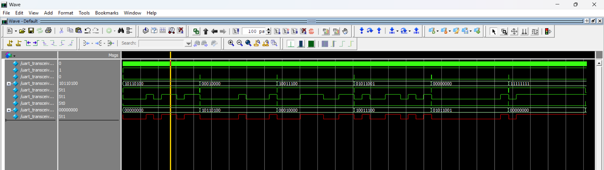
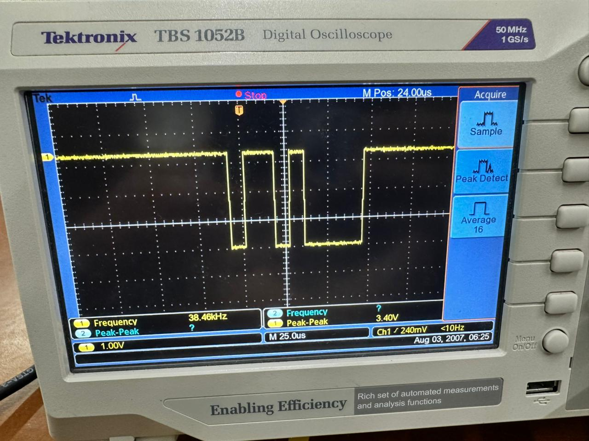
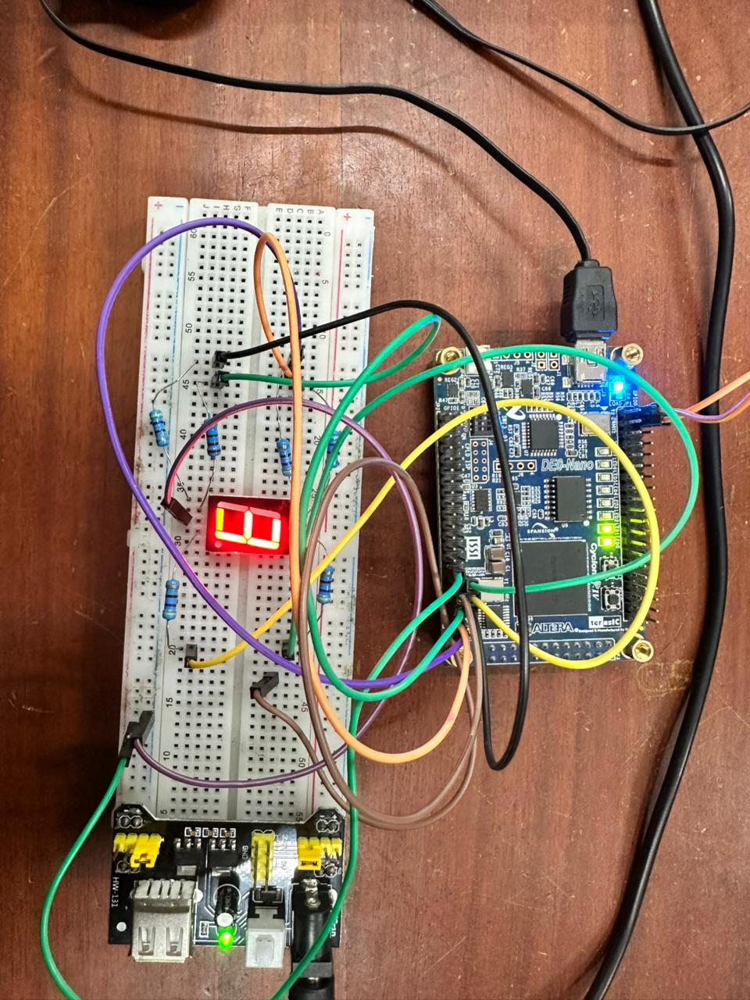
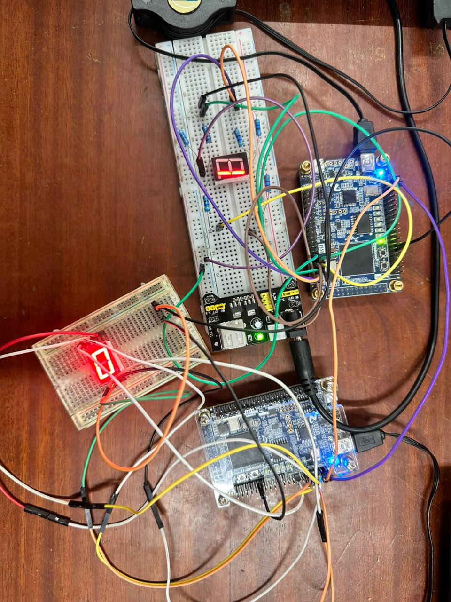

## Overview

Universal Asynchronous Receiver/Transmitter (UART) is a widely used serial communication method that enables data exchange between two devices. Unlike synchronous protocols, UART communication is asynchronous and does not use a clock signal. Instead, data transmission is coordinated using start and stop bits.

In a typical UART system, the transmitter converts parallel data into serial format and sends it through the **TX** line. The receiver captures the incoming serial data through the **RX** line and reconstructs it back into parallel form. The communication speed is determined by the **baud rate**, which must be the same at both transmitter and receiver for reliable operation.

## Project Description

This project implements a UART transceiver using **Verilog HDL**. The design is first verified through simulation using a testbench and then implemented on the **DE0-Nano FPGA board**. Successful communication is demonstrated by connecting the TX and RX pins between two FPGA boards.

## Simulation Result

  

## Hardware Transmission

<table>
  <tr>
    <td align="center"><b>Oscilloscope TX</b></td>
    <td align="center"><b>with Own Receiver</b></td>
    <td align="center"><b>FPGA to FPGA</b></td>
  </tr>
  <tr>
    <td></td>
    <td></td>
    <td></td>
  </tr>
</table>
